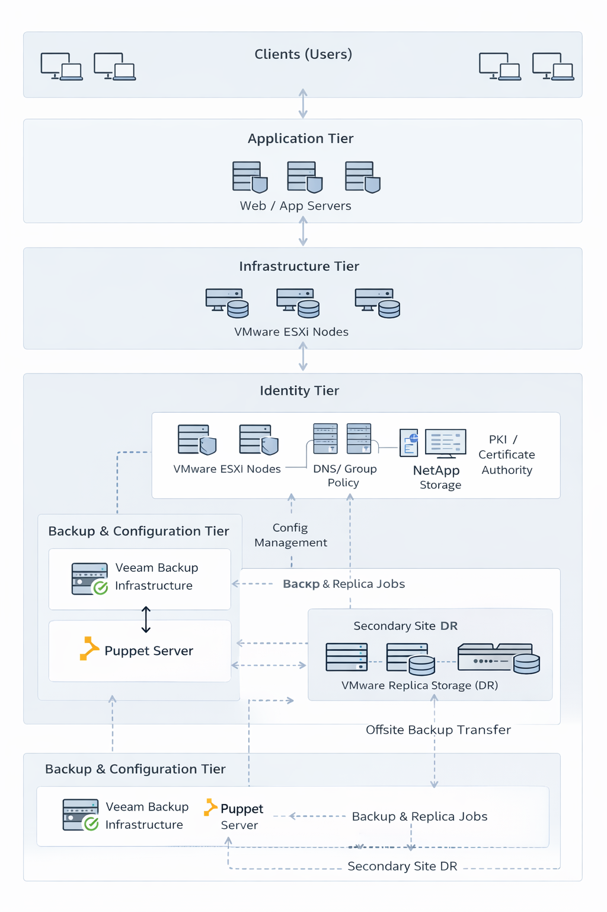
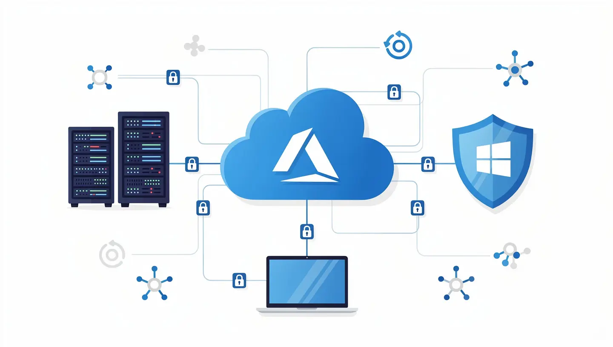

# Enterprise Infrastructure Architecture Portfolio

This repository documents enterprise infrastructure architecture patterns designed for regulated, high-availability environments operating primarily on-premises.

The designs focus on identity consolidation, backup resilience, configuration governance, and operational survivability under failure conditions.

This is not a lab collection.  
It represents structured design thinking for production infrastructure.

---

## Executive Overview

Modern enterprise infrastructure must support:

- Multi-site identity architectures with WAN-failure resilience
- On-premises virtualization stacks with validated backup discipline
- Configuration management governance across all workloads
- Regulated workload controls (PCI / SOC environments)

This portfolio documents architecture patterns that prioritize stability, clarity, and recoverability over complexity.

---

## Architecture Domains

### 🔐 Active Directory Multi-Site Architecture

Location: [active-directory-multisite](./active-directory-multisite)

Design goals:

- Consolidate multiple identity domains into a unified forest
- Preserve site-level authentication autonomy during WAN outages
- Support badge-based local authentication without remote DC dependency
- Define RODC vs. Writable DC placement strategy
- Provide a sequenced migration playbook for domain consolidation

Includes forest and domain strategy, AD Sites & Services topology, replication health monitoring, failure mode analysis, WAN outage survivability model, and migration sequencing.

---

### 💾 Veeam On-Premises Enterprise Deployment

Location: [veeam-onprem-deployment](./veeam-onprem-deployment)

Design goals:

- Implement a measurable, testable backup strategy — not just scheduled jobs
- Integrate VMware, NetApp, and Veeam into a coherent data protection stack
- Enforce restore validation discipline: backups confirmed only after successful restore
- Align RPO/RTO objectives with operational reality through regular testing

Includes proxy and repository sizing, VMware transport mode selection (Direct SAN / HotAdd / NBD), application-aware processing, NetApp snapshot coordination, and restore validation methodology.

---

### ⚙️ Puppet Enterprise Migration Strategy

Location: [puppet-enterprise-migration](./puppet-enterprise-migration)

Design goals:

- Transition from Open Source Puppet to Puppet Enterprise
- Restructure codebase to production-grade Roles & Profiles architecture
- Enforce Git-based configuration governance via r10k / Code Manager
- Realign hostnames and domain structures cleanly

Includes r10k / Code Manager structure, certificate re-issuance planning, Hiera hierarchy strategy, node classification governance, and phased rollout methodology.

---

### 🖥️ Windows Infrastructure Stabilization Plan

Location: [windows-infrastructure-stabilization](./windows-infrastructure-stabilization)

Design goals:

- Stabilize and audit Windows-based infrastructure from a known baseline
- Validate Active Directory health across all domain controllers
- Establish patch compliance, GPO governance, and DNS integrity
- Integrate monitoring and alerting discipline

Includes 30-60-90 day operational framework, AD health checks (`dcdiag`, `repadmin`), DNS audit model, SYSVOL / DFS-R validation, patch deployment rings, and monitoring integration checkpoints.

---

### 🧪 Disaster Recovery & Failure Testing

Location: [disaster-recovery-testing](./disaster-recovery-testing)

Design goals:

- Ensure infrastructure survives realistic failure scenarios — not just ideal conditions
- Validate restore and failover procedures with measured RTOs
- Eliminate silent dependency assumptions before they become production incidents

Includes AD WAN failure simulation, VMware HA validation, NetApp SnapMirror failover, Veeam restore drills, Puppet node rebuild validation, and RTO documentation practices.

Infrastructure health is proven through testing — not assumed.

---

## Design Philosophy

The infrastructure patterns documented here follow five operational principles:

1. **Detect issues before users report them** — monitoring and alerting are baseline requirements
2. **Design for failure, not ideal conditions** — every system must be tested under realistic failure
3. **Prefer simple, governable architectures** — complexity that cannot be maintained is a liability
4. **Validate restores regularly** — a backup job log is not a restore confirmation
5. **Prioritize stable systems over unnecessary complexity** — operational reliability over trend-driven engineering

---

## Intended Audience

This repository is relevant for infrastructure engineers, systems architects, enterprise IT leads, identity architects, and on-premises platform engineers — particularly in environments operating VMware-based virtualization, multi-site Active Directory, hybrid identity models, on-premises backup strategies, or compliance-bound workloads.

---

## Operational Perspective

These documents assume defined change management, monitoring and alerting integration, documented ownership of infrastructure domains, and regular architecture review and failure simulation.

Infrastructure must be measurable, testable, and predictable.

---

*This portfolio represents structured thinking applied to real-world enterprise constraints.*
